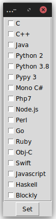

# quera-bundle
---
Quera-Bundle is a set of python scripts to facilitate the use of the Quera project, including converting the Quera results file into CSV files and plotting them, setting the default languages for the assignments, and a simple test case generator for the assignments.

## Quera History
[Quera](http://quera.ir) is a technology company that aims to create a community of developers, educate them, and help them find the perfect job. Its online judge system is the sequel of [Sharif-Judge](https://github.com/mjnaderi/Sharif-Judge) --a free and open-source online judge for C, C++, Java, and Python programming courses-- developed by [Mohammad Javad Naderi](https://github.com/mjnaderi) in 2014. Thereafter, it has been used as a 
main platform by most of the Persian-Language universities to automate the evaluation of programming assignments. 
These days, [Quera](http://quera.ir) is hosting lots of contests and challenges in Iran.


## Installing dependencies

You can use the `pip` program to install the dependencies on your own. They are all listed in the `requirements.txt` file.

To use this method, you would proceed as:

```pip install -r requirements.txt```

To make Firefox work with Python selenium, you need to install the `geckodriver`. The geckodriver driver will start the real firefox browser and supports Javascript.


## Running the Scritps

### [`qbsetlang`] Set Default Programming Languages for an Assingment

When we set an assingment, we should set the acceptable languages for each problem manually. When you copy a set of problems from [Quera Question's Bank], it is really annoying to set the wanted languages one bye one. The `qbsetlang` makes this process automatically.

#### How to use

The script needs the user and password to login into http://quera.ir in order to open the assignment. Each assignment has a specific URL: `https://quera.org/course/assignments/<number>/problems`. The `<number>` should be passed to the script. 

```$ python qbsetlang <number> -u <username>  -p <password>```

It will open the assignment with the `PySelenium` and gets the languages from the user for the first problem and then applies it to the other problems. 

<p align="center"></p>

The program saves the chosen languages into `config.yaml` file and then reuses it afterward without any question. To reconfigure the desired languages, the `--config` option should be used. It also saves the `username` and `password` into the config file, thus `user` and `pass` is mandatory for the first run. 

### [`qbgentest`] Test Case Generator

The `qbgentest` makes the `in` and `out` folders containing the test cases and their solutions in an acceptable format for [Quera](http://quera.ir). It gets the name of the solution program as the input of `TestCase` class constructor and it assumes that the name contains a number that will be used in the name of input and output folders, respectively `in{num}` and `out{num}`. Then the created object would be called with the input including the `\n` to separate each line of the input.

If you run the `Makefile` in `shell`, it will run the `qbgentest`. 
Running the following command packs all test case folders in `zip` files for uploading to Quera.

```$ make zip```

### [`qbcompmark`] Computes Total Grades and Plots Them

At first, download the assignments' grade via quera in `XLSX` format. Then, just run the `qbcompmark` in the folder containing those files. It will create a CSV file that includes all marks from all assignments and their sum. It also plots the summation for each student in a single graph depicting their attempts during the semester. 
